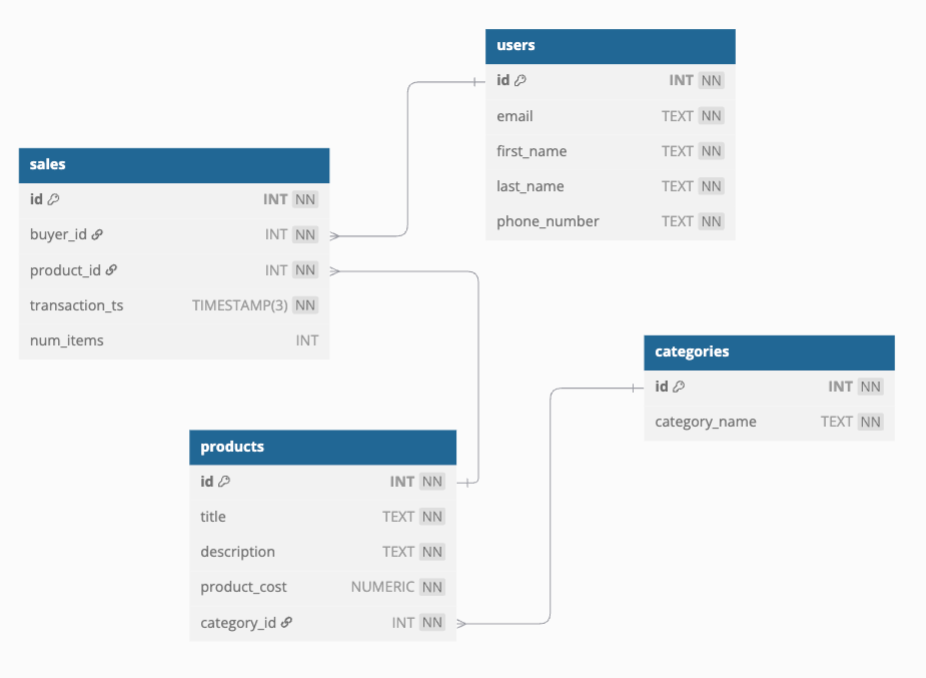

# Data and SQL

1. Connect to the `toy` database using the credentials provided.
2. Write queries to find the following information from the database:
  
  a. What are the top three products by **number of items sold**? You
   need to provide the product names and the sales numbers for each. (Some
   transactions involve more than one item being sold...)
  
  b. What are the top three products by **monetary value**? You need
   to provide the product names and the total value of sales for each (where 
   possible. What might cause a problem? Hint: check some records for December 2022.)
  
  c. Which user was the top spender in December 2022? Provide their
  email address and phone number.

When you run the queries you should save your results to a separate text file, you can do this with the redirection (`>`) operator like so:

```bash
psql -h "HOST_URL" -p 5432 -U "USERNAME" -d "DATABASE_NAME" -f 1-data/queries.sql > query_output.txt
```

Commit your results and the completed queries, and push them to your GitHub repository.

Please submit your code for review using the `/nchelp review` slack command.


The ERD for this database is shown.


